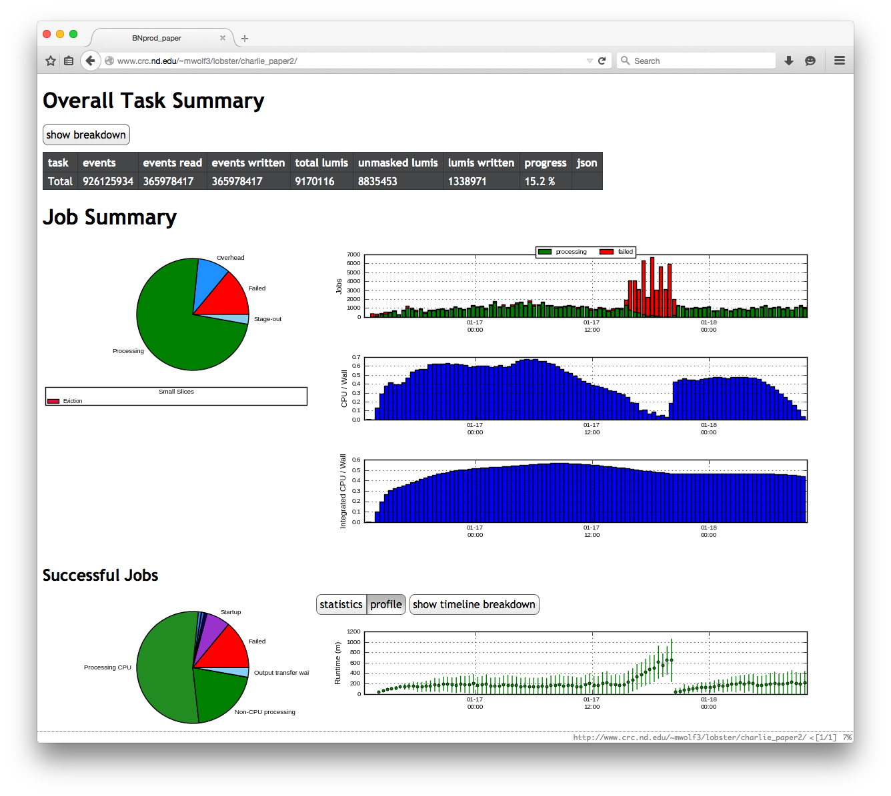
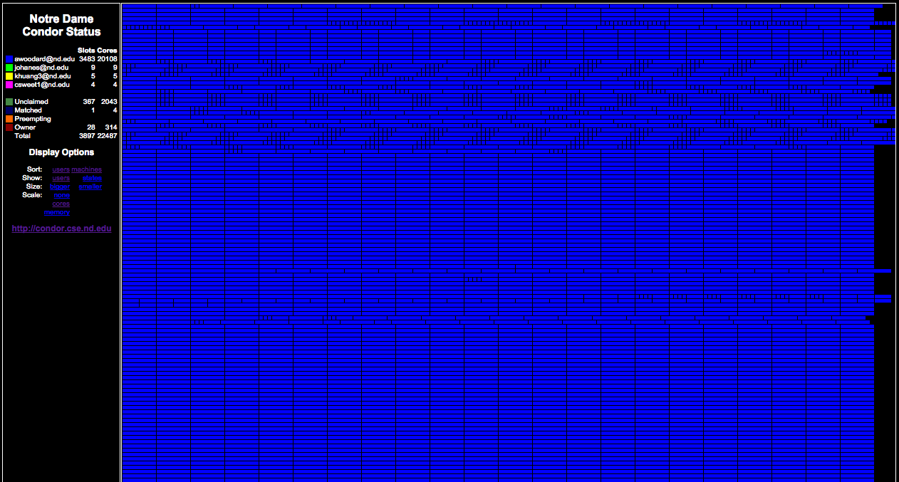

Performance
===========

Monitoring
----------

Due to the large number of interacting components in Lobster,
troubleshooting problems can be very challenging.
A hiccup in the performance of one element can have a cascading impact on
the rest of the system.
For example, if the performance of a data cache is impeded for some reason,
this will be reflected as low bandwidth in data transfers, resulting in low
CPU efficiency for individual tasks, and then eventually in extended run
times.
To address this problem, we have implemented a comprehensive monitoring
technique that covers almost every aspect of the system and the
infrastructure.
This enables us to disentangle the root cause of many runtime performance
problems.

The timeline of a task is broken into small steps, and timing information
about every step of every task stored in a database.  Periodically, the
monitoring overview is updated with refreshed historical and statistical
views of all essential components within Lobster.

Scaling
-------

We were very fortunate to have been granted a brief testing slot
immediately following the most recent bi-annual maintenance period at the
CRC, before the normal condor job load resumed.
This allowed us to perform a large-scale run, which we used to learn about
what performance bottlenecks await us as we increase in scale.

   `Lobster` running on almost all available cores at the Computing Center
   of the University of Notre Dame during a maintenance shutdown.
